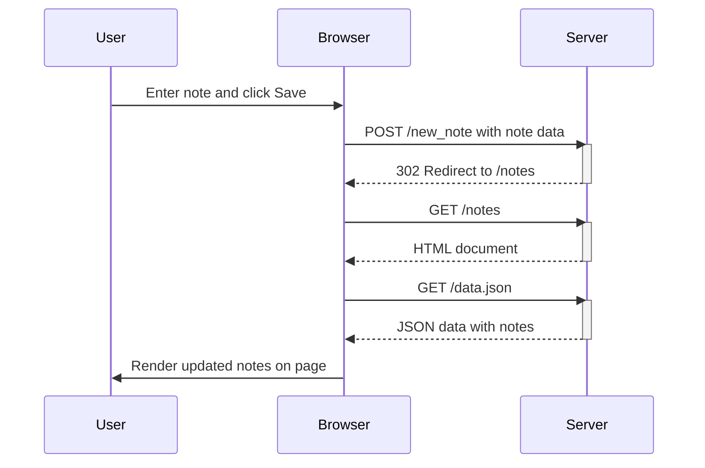

```mermaid
sequenceDiagram
    participant User
    participant Browser
    participant Server

    User->>Browser: Enter note and click Save
    Browser->>Server: POST /new_note with note data
    activate Server
    Server-->>Browser: 302 Redirect to /notes
    deactivate Server
    Browser->>Server: GET /notes
    activate Server
    Server-->>Browser: HTML document
    deactivate Server
    Browser->>Server: GET /data.json
    activate Server
    Server-->>Browser: JSON data with notes
    deactivate Server
    Browser->>User: Render updated notes on page
```
