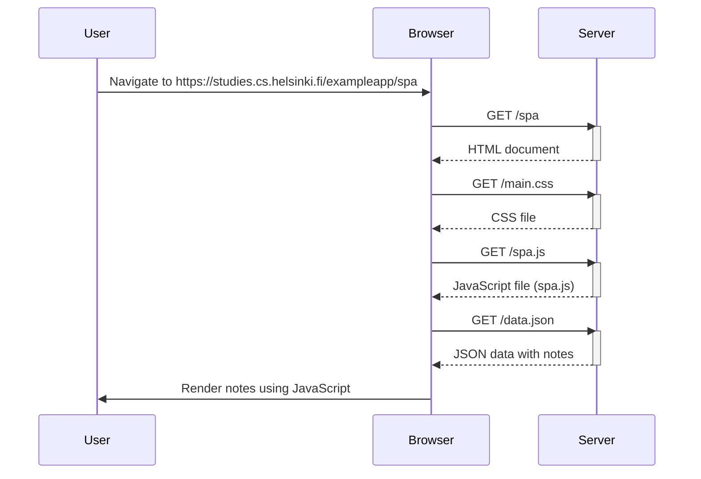

```mermaid
sequenceDiagram
    participant User
    participant Browser
    participant Server

    User->>Browser: Navigate to https://studies.cs.helsinki.fi/exampleapp/spa
    Browser->>Server: GET /spa
    activate Server
    Server-->>Browser: HTML document
    deactivate Server
    Browser->>Server: GET /main.css
    activate Server
    Server-->>Browser: CSS file
    deactivate Server
    Browser->>Server: GET /spa.js
    activate Server
    Server-->>Browser: JavaScript file (spa.js)
    deactivate Server
    Browser->>Server: GET /data.json
    activate Server
    Server-->>Browser: JSON data with notes
    deactivate Server
    Browser->>User: Render notes using JavaScript
```
